# Arquitectura del Microservicio UVICAR Schedule

```mermaid
flowchart TB
    %% =====================================================
    %% Actores y entrada
    %% =====================================================
    externalClient["Cliente externo / Integraciones<br/>curl, sistemas consumidores, operadores"]
    healthClient["Kubernetes probes / Monitoreo<br/>readiness, liveness, health"]
    scheduler["Spring Scheduler interno<br/>EnableScheduling"]

    %% =====================================================
    %% Despliegue
    %% =====================================================
    subgraph deploy["Despliegue"]
        dockerBuild["Docker multi-stage build<br/>Maven 3.9.9 + Temurin 17<br/>mvn package -DskipTests"]
        dockerImage["Imagen Docker<br/>localhost/uvischedule:latest<br/>/app/app.jar"]
        entrypoint["docker/entrypoint.sh<br/>Java 17 runtime<br/>TLS legacy opcional"]

        subgraph k8s["K3s / Kubernetes"]
            namespace["Namespace<br/>uvischedule"]
            configMap["ConfigMap<br/>uvischedule-config"]
            secret["Secret<br/>azure-keyvault-secret"]
            deployment["Deployment<br/>uvischedule<br/>1 replica"]
            service["Service NodePort<br/>8081 -> 30081"]
        end
    end

    dockerBuild --> dockerImage --> entrypoint --> deployment
    namespace --> configMap --> deployment
    namespace --> secret --> deployment
    deployment --> service
    externalClient -->|HTTP :30081| service
    service -->|HTTP :8081| boot
    healthClient -->|GET /actuator/health/readiness<br/>GET /actuator/health/liveness| service

    %% =====================================================
    %% Aplicacion Spring Boot
    %% =====================================================
    subgraph app["Microservicio Spring Boot 3.4 / Java 17"]
        boot["SchedulerBaseApplication<br/>SpringBootApplication<br/>EnableScheduling"]

        subgraph config["Configuracion runtime"]
            properties["application.properties<br/>server.port=8081<br/>spring.sql.init.mode=never"]
            datasource["DataSource SQL Server<br/>mssql-jdbc + JdbcTemplate"]
            shedlockConfig["ShedLockConfig<br/>JdbcTemplateLockProvider<br/>usingDbTime"]
            mailConfig["Spring Mail<br/>smtp.gmail.com:587 default"]
            actuator["Spring Actuator<br/>health, info, probes"]
        end

        subgraph api["API REST"]
            transmissionController["TransmissionController<br/>GET /api/transmissions"]
            clientesReportController["ClientesGrandesReportController<br/>GET /api/reports/clientes-grandes/sin-trans-3dias"]
            unidadesReportController["UnidadesSinTransmisionReportController<br/>GET /api/reports/unidades/sin-transm-mtcosinrg"]
            notificationController["EventEmailNotificationController<br/>GET /api/notifications/event-emails/pending<br/>POST /api/notifications/event-emails/dispatch"]
        end

        subgraph transmission["Modulo transmission"]
            transmissionFacade["TransmissionFacadeImpl"]
            transmissionService["TransmissionQueryServiceImpl"]
            transmissionRepository["TransmissionQueryRepository<br/>SELECT TOP FROM tTransmisiones<br/>ventana con SYSDATETIME"]
            transmissionDto["TransmissionResponse"]
            seedJob["TransmissionSeedJob<br/>ShedLock configurado<br/>Scheduled comentado"]
            seedRepository["TransmissionSeedRepository<br/>insertRandomRows"]
            templateProvider["TransmissionTemplateProvider<br/>seed/transmission-templates.json"]
        end

        subgraph reports["Modulo reports"]
            reportFacade["ClientesGrandesReportFacadeImpl"]
            reportService["ClientesGrandesReportServiceImpl"]
            reportRepository["ClientesGrandesReportRepository<br/>EXEC SPs de reportes"]
        end

        subgraph notifications["Modulo notifications"]
            notificationFacade["EventEmailNotificationFacadeImpl"]
            notificationService["EventEmailNotificationServiceImpl"]
            notificationRepository["EventEmailNotificationRepository<br/>EXEC pa_envioCorreosEventosAlertas_1Hora<br/>parametro p_nRazTra"]
            emailJob["EventEmailNotificationJob<br/>Scheduled cron cada hora default<br/>SchedulerLock job_event_email_notifications"]
            smtpSender["SmtpEventEmailSender<br/>delivery-mode=smtp"]
            logSender["LoggingEventEmailSender<br/>delivery-mode=log"]
            notificationDtos["DTOs<br/>PendingEventEmailNotification<br/>EventEmailJobResult<br/>EventEmailDispatchRequest"]
        end

        subgraph sampleJobs["Jobs base"]
            sampleJobsComponent["SampleScheduledJobs<br/>jobs de ejemplo con ShedLock"]
        end
    end

    boot --> properties
    boot --> actuator
    properties --> datasource
    properties --> mailConfig
    properties --> shedlockConfig

    %% REST hacia capas internas
    transmissionController --> transmissionFacade --> transmissionService --> transmissionRepository --> transmissionDto
    clientesReportController --> reportFacade
    unidadesReportController --> reportFacade
    reportFacade --> reportService --> reportRepository
    notificationController --> notificationFacade --> notificationService
    notificationFacade --> notificationService
    notificationService --> notificationRepository
    notificationService --> smtpSender
    notificationService --> logSender
    notificationService --> notificationDtos

    %% Scheduler hacia jobs
    scheduler --> emailJob --> notificationFacade
    scheduler -.-> sampleJobsComponent
    scheduler -.-> seedJob
    seedJob --> seedRepository
    seedRepository --> templateProvider

    %% Actuator
    actuator --> boot

    %% =====================================================
    %% Sistemas externos y persistencia
    %% =====================================================
    subgraph external["Dependencias externas"]
        keyVault["Azure Key Vault<br/>uvischedule-db-url-1<br/>uvischedule-db-password<br/>uvischedule-mail-user-name<br/>uvischedule-mail-password"]
        envVars["Variables de entorno fallback<br/>UVISCHEDULE_DB_URL<br/>UVISCHEDULE_DB_PASSWORD<br/>UVICAR_DB_USERNAME<br/>MAIL variables"]
        sqlServer["SQL Server<br/>tTransmisiones<br/>stored procedures<br/>tabla shedlock"]
        smtpServer["Servidor SMTP<br/>envio de alertas por correo"]
    end

    configMap -->|SERVER_PORT, flags, MAIL vars, JOBS vars| properties
    secret -->|AZURE_CLIENT_ID<br/>AZURE_CLIENT_SECRET<br/>AZURE_TENANT_ID| properties
    properties -->|Spring Cloud Azure| keyVault
    envVars --> properties
    keyVault -->|secretos DB y mail| datasource
    keyVault -->|secretos SMTP| mailConfig

    datasource -->|JDBC| sqlServer
    transmissionRepository -->|query tTransmisiones| datasource
    reportRepository -->|EXEC reportes| datasource
    notificationRepository -->|EXEC notificaciones| datasource
    seedRepository -->|INSERT seed data| datasource
    shedlockConfig -->|locks distribuidos| sqlServer
    sampleJobsComponent -->|usa locks ShedLock| shedlockConfig
    emailJob -->|usa locks ShedLock| shedlockConfig
    seedJob -->|usa locks ShedLock| shedlockConfig
    smtpSender -->|Spring Mail| mailConfig
    mailConfig --> smtpServer
    logSender -->|mock/log local| appLogs["Logs de aplicacion"]

    %% =====================================================
    %% Endpoints publicos
    %% =====================================================
    externalClient -->|GET /api/transmissions| transmissionController
    externalClient -->|GET /api/reports/clientes-grandes/sin-trans-3dias| clientesReportController
    externalClient -->|GET /api/reports/unidades/sin-transm-mtcosinrg-15min-a-2hrs| unidadesReportController
    externalClient -->|GET /api/reports/unidades/sin-transm-mtcosinrg-2hrs-a-2dias| unidadesReportController
    externalClient -->|GET /api/reports/unidades/sin-transm-mtcosinrg-mas-de-2dias| unidadesReportController
    externalClient -->|GET /api/notifications/event-emails/pending con nRazTra| notificationController
    externalClient -->|POST /api/notifications/event-emails/dispatch| notificationController

    %% =====================================================
    %% Estilos
    %% =====================================================
    classDef actor fill:#f7f7f7,stroke:#555,stroke-width:1px,color:#111;
    classDef spring fill:#e8f5e9,stroke:#2e7d32,stroke-width:1px,color:#111;
    classDef module fill:#e3f2fd,stroke:#1565c0,stroke-width:1px,color:#111;
    classDef deploy fill:#fff3e0,stroke:#ef6c00,stroke-width:1px,color:#111;
    classDef external fill:#fce4ec,stroke:#ad1457,stroke-width:1px,color:#111;
    classDef data fill:#ede7f6,stroke:#512da8,stroke-width:1px,color:#111;

    class externalClient,healthClient,scheduler actor;
    class boot,properties,datasource,shedlockConfig,mailConfig,actuator spring;
    class transmissionController,clientesReportController,unidadesReportController,notificationController,transmissionFacade,transmissionService,transmissionRepository,transmissionDto,seedJob,seedRepository,templateProvider,reportFacade,reportService,reportRepository,notificationFacade,notificationService,notificationRepository,emailJob,smtpSender,logSender,notificationDtos,sampleJobsComponent module;
    class dockerBuild,dockerImage,entrypoint,namespace,configMap,secret,deployment,service deploy;
    class keyVault,envVars,smtpServer,appLogs external;
    class sqlServer data;
```

## Lectura rapida

- El microservicio entra por `Service NodePort 30081` y corre internamente en `server.port=8081`.
- Las rutas REST siguen la cadena `Controller -> Facade -> Service -> Repository -> JdbcTemplate -> SQL Server`.
- `EventEmailNotificationJob` corre programado y comparte el mismo flujo de notificaciones que el endpoint `POST /dispatch`.
- `ShedLock` usa SQL Server para coordinar jobs y evitar ejecuciones duplicadas.
- Los secretos vienen de Azure Key Vault; si se desactiva, se usan variables de entorno fallback.
- `TransmissionSeedJob` esta documentado como componente existente, pero su `@Scheduled` esta comentado actualmente.
